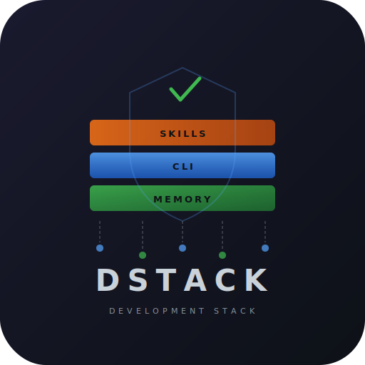

<p align="center">
  
</p>

<h1 align="center">dstack</h1>

<p align="center">
  Development stack for AI-assisted multi-repo work.<br>
  Persistent memory, quality gates, VPS deployment, cross-repo sync.
</p>

<p align="center">
  <a href="https://crates.io/crates/dstack-cli"></a>
  <a href="https://github.com/dirmacs/dstack/blob/main/LICENSE"></a>
  <a href="https://dirmacs.github.io/dstack"></a>
  
</p>

---

**dstack** is a Rust CLI + Claude Code plugin that encodes battle-tested workflows from production work across 15+ repos. It gives your AI coding agent persistent memory, awareness of your whole repo fleet, and quality gates that prevent shipping half-done work.

Built by [DIRMACS](https://dirmacs.com). Born from [real pain](STORY.md) — Claude degradation incidents, a team communication breakdown, and a client meeting that almost didn't happen.

## Install

```bash
cargo install dstack-cli
```

```bash
# Or from source
git clone https://github.com/dirmacs/dstack && cd dstack
cargo install --path crates/dstack-cli
```

## Configure

```toml
# ~/.config/dstack/config.toml

[memory]
backend = "file"  # "file" (default) or "eruka"

[repos]
tracked = ["ares", "pawan", "my-frontend"]

[deploy.ares]
build = "cd /opt/ares && cargo build --release"
service = "ares"
smoke = "curl -sf http://localhost:3000/health"

[git]
author_name = "yourname"
author_email = "you@example.com"
```

## What it does

```bash
dstack config                        # show configuration
dstack memory load --project myapp   # load project memory
dstack memory save "key" "value"     # persist a learning
dstack memory query "pattern"        # search memory
dstack memory export                 # export all memory as JSON
dstack sync --status                 # cross-repo git status (ahead/behind)
dstack sync                          # pull + push all clean repos
dstack sync --dry-run                # preview without pushing
dstack deploy ares                   # build + restart + smoke test
dstack deploy --all                  # deploy all configured services
dstack deploy ares --rollback        # rollback to previous binary
dstack audit                         # workspace summary dashboard
dstack audit --pre-commit            # quality gate checklist
dstack audit --stale                 # find stale companion docs
```

## Workspace (2 crates)

| Crate | What |
|-------|------|
| **dstack-memory** | MemoryProvider trait, FileProvider (JSON), ErukaProvider (REST API) |
| **dstack-cli** | CLI binary + library: memory, deploy, sync, audit commands |

## Claude Code Plugin

6 skills, 3 hooks, 3 commands. Works alongside [superpowers](https://github.com/obra/superpowers) and GSD — no conflicts.

```bash
# Install as Claude Code plugin
claude plugin install /path/to/dstack/plugin
```

### Skills

| Skill | Purpose |
|-------|---------|
| **using-dstack** | Session orientation, available commands |
| **eruka-memory** | When/how to persist learnings |
| **multi-repo-ops** | Cross-repo dependency awareness, build order |
| **vps-deploy** | Build + restart + smoke test workflow |
| **companion-docs** | Track implementation reality vs plan intent |
| **quality-gates** | Pre-commit 5-question checklist |

### Hooks

| Hook | Event | What |
|------|-------|------|
| **session-start** | SessionStart | Loads project memory, shows repo status |
| **quality-gate** | PreToolUse | Injects quality checklist on `git commit` |
| **context-monitor** | PostToolUse | Warns at 50/100 tool calls to save findings |

### Commands

| Command | What |
|---------|------|
| `/deploy [service]` | Deploy a service or all services |
| `/sync [status\|dry-run]` | Sync tracked repos |
| `/audit [stale]` | Quality audit |

## Memory Backends

**File** (default) — JSON files at `~/.local/share/dstack/memory/`. Zero dependencies. Works offline.

**Eruka** — REST API backend for team-shared context memory. Set `$DSTACK_ERUKA_KEY` and configure the URL in config.toml. Memory becomes a team resource instead of dying with each session.

## The Quality Gate

Before every commit, 5 questions:

1. **Negative tests?** — Did I test what happens when things go wrong?
2. **Live verification?** — Did I verify against the live system, not just compilation?
3. **Companion doc updated?** — With details, not a one-liner "DONE"?
4. **Tests prove the change?** — Would they fail without my code change?
5. **Truly done?** — Or am I just showing progress?

These exist because skipping them cost us a client meeting.

## Architecture

```
dstack/
├── crates/
│   ├── dstack-memory/     # MemoryProvider trait + backends (file, eruka)
│   └── dstack-cli/        # CLI binary (clap) + library
├── plugin/
│   ├── .claude-plugin/    # Plugin metadata
│   ├── skills/            # 6 SKILL.md files
│   ├── hooks/             # 3 hook scripts (Claude Code format)
│   ├── commands/          # 3 command definitions
│   └── CLAUDE.md          # Bootstrap instructions
├── overlays/              # Private config examples
└── site/                  # Documentation (Zola)
```

## Philosophy

- **Humans verify, AI executes** — Quality gates enforce human checkpoints
- **Memory is a team resource** — Context shouldn't die with a session
- **Friction kills teams before bugs do** — Automate the boring parts
- **Ship the unique value** — Don't rebuild what superpowers/GSD already do

## License

MIT
